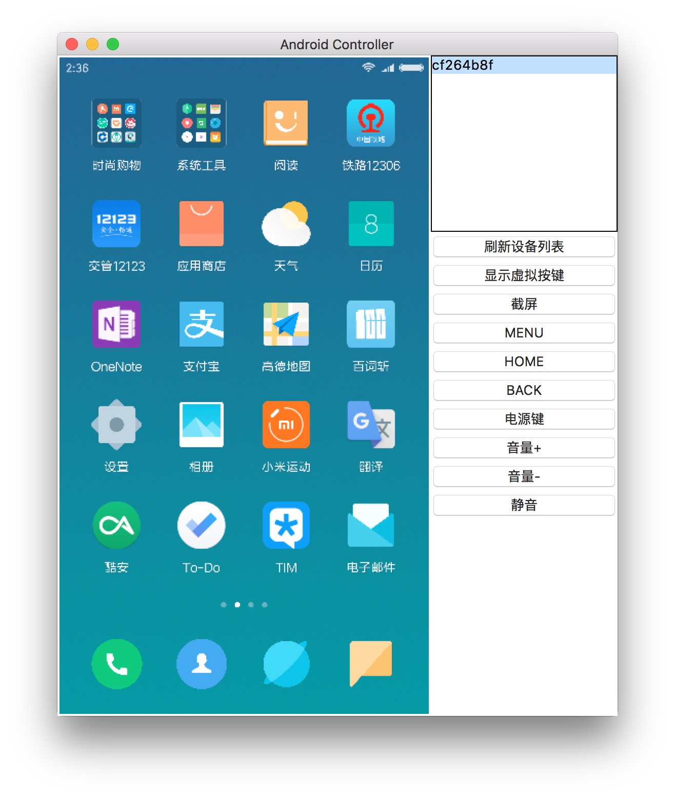

# Android Controller

在电脑上控制手机的控制器，基于 Python3。

## 截图

<div align="center"></div>

## 用法

> 请确保已经安装 adb 且已添加到 PATH 环境变量中，手机已经开启「USB调试」。

1. 安装 Python3；

2. 安装依赖库；

    ```sh
    pip3 install -r requirements.txt
    ```

3. 运行

    ```sh
    python3 main.py
    ```
## 需求list

1. 安装
2. 卸载
3. 覆盖安装
4. 录屏
5. 截图
6. 清除数据
7. 打开wifi
8. 关闭wifi


## 注意事项

* 模拟按键的功能在部分机型（比如小米）需要在「开发者选项」里打开允许通过 USB 调试修改权限或模拟点击的开关。
